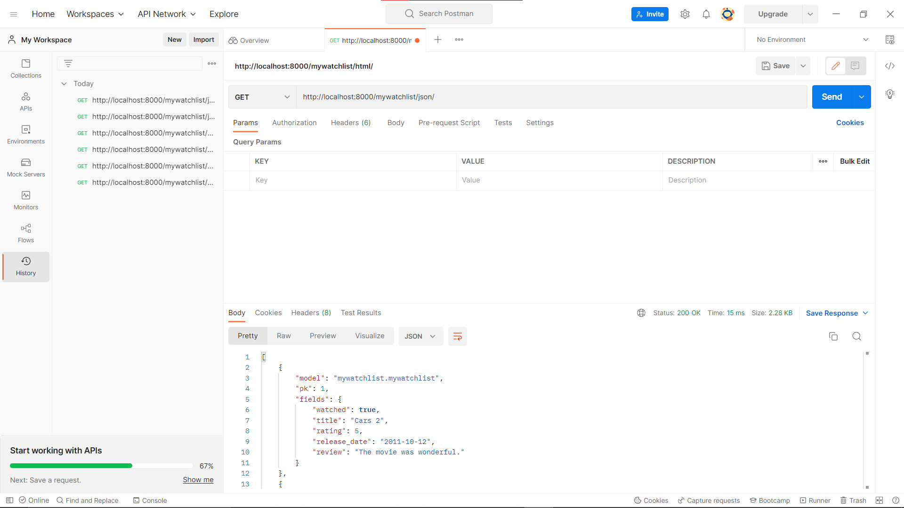

# Link Heroku App

http://tugas2-gansixeneh-2106629963.herokuapp.com/mywatchlist/html/ \
http://tugas2-gansixeneh-2106629963.herokuapp.com/mywatchlist/xml/ \
http://tugas2-gansixeneh-2106629963.herokuapp.com/mywatchlist/json/

# Perbedaan JSON, XML, dan HTML

- JSON dan XML adalah file format yang digunakan untuk menyimpan data-data yang diperlukan, sedangkan HTML adalah file format yang menjelaskan bagaimana cara menampilkan data tersebut pada suatu halaman web.

- Cara penulisan pada HTML dan XML menggunakan start tag dan end tag, sedangkan JSON menyimpan data menggunakan pasangan data dan value, sehingga tidak memerlukan start tag dan end tag. Oleh karena itu, suatu data yang sama dapat ditulis dengan lebih pendek di JSON dibandingkan HTML/XML.

- JSON lebih mudah digunakan dibandingkan dengan XML dan dapat diproses lebih cepat oleh aplikasi-aplikasi AJAX.

# Pentingnya Data Delivery dalam Implementasi Platform

Ketika kita menggunakan suatu platform website/aplikasi, tentunya ada data yang perlu diminta untuk ditampilkan agar platform tersebut dapat memberikan informasi yang kita perlukan. Misalnya, ketika kita ingin membaca e-mail yang kita terima, tentu kita harus meminta data e-mail tersebut terlebih dahulu. Oleh karena itu, dalam pembuatan/pengimplementasian suatu platform, kita perlu membuat proses data delivery yang efisien dan sesuai dengan kebutuhan platform tersebut.

# Pengimplementasian Checklist

Pertama-tama, kita akan menyimpan data ``MyWatchList`` yang akan kita gunakan di ``fixtures/initial_mywatchlist_data.json``. Kita juga perlu mendefinisikan data tersebut di ``models.py`` untuk menjelaskan field-field dari data tersebut, yaitu ``watched``, ``title``, ``rating``, ``release_date``, dan ``review``, serta tipe field yang sesuai untuk masing-masing field, misalnya boolean atau integer.

Setelah mempersiapkan data, kita dapat mengakses data tersebut dari ``views.py`` dengan memanggil method ``MyWatchList.objects.all()``. Setelah itu, kita hanya perlu menggunakan fungsi ``HttpResponse()`` yang sudah tersedia di library ``django.html`` untuk mengubah data yang kita miliki menjadi file format JSON/XML.

Untuk menampilkan data tersebut dalam bentuk HTML, kita perlu menyimpan data tersebut pada ``list_mywatchlist`` dan menyiapkan string ``message`` yang memberi tahu apakah film yang ditonton sudah mencapai 50% atau belum. Setelah itu, kita akan menyimpan data-data tersebut pada dictionary ``context`` dan menggunakan fungsi ``render()`` dari library ``django.shortcuts`` untuk menampilkan data tersebut menggunakan  ``templates/mywatchlist.html`` yang sudah kita sediakan.

# Screenshot Postman

